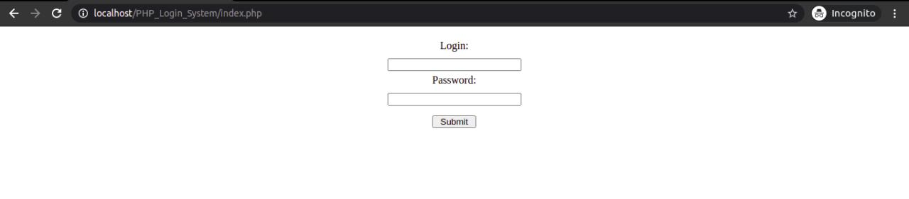
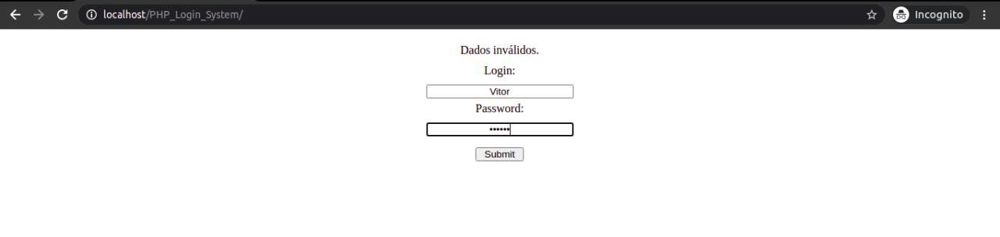
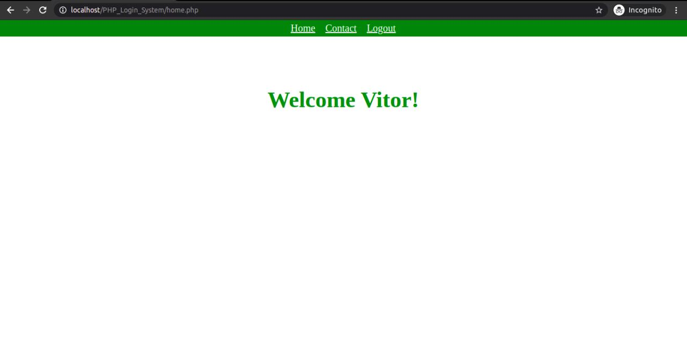
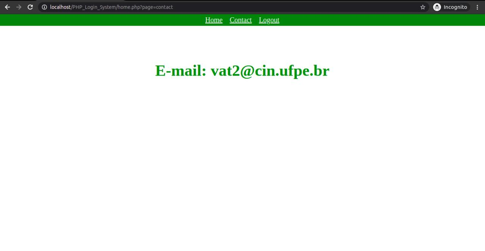

# PHP_Login_System
Sistema de Login em PHP sem o uso de Banco de Dados. Os códigos foram testados em um Servidor Local (localhost) configurado com Apache. 

O objetivo era apenas aplicar as validações e criar o básico de um Sistema de Login. Não possui cadastro pois não foi utilizado um Banco de Dados (MySQL), então o Login é "Vitor" e o Password é "123456".

